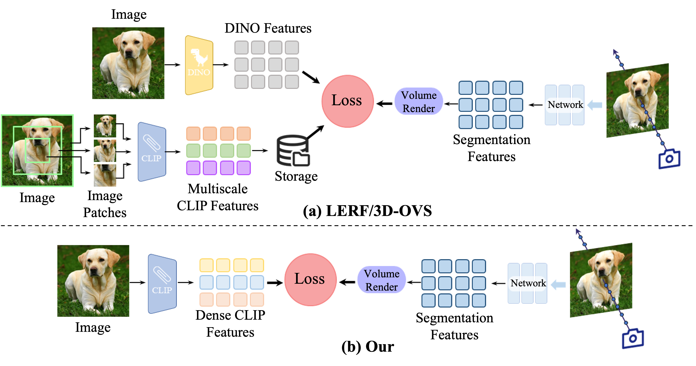
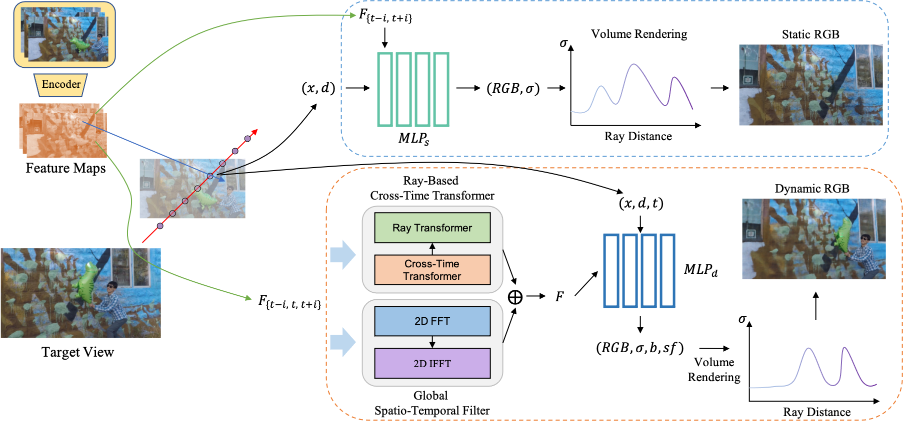
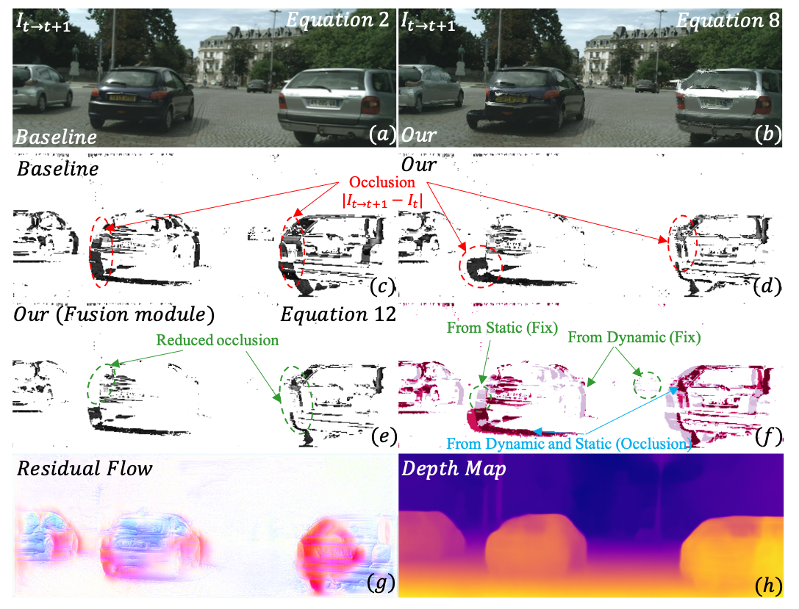

    
        Currently, I am a last year Phd student studying Computer Science at Durham University and advised by Prof. <a href="https://www.durham.ac.uk/staff/yang-long/">Yang Long</a>. My current research lies at the intersection of computer vision, computer graphics, and machine learning, focusing on understanding the dynamic three-dimensional world as captured by everyday images and videos. By moving beyond the limitations of traditional 2D or 2.5D representations, I strive to develop multi-view reconstruction techniques that offer a comprehensive understanding of complex environments. Ultimately, my long-term goal is to create intelligent systems capable of perceiving, interpreting, and continually learning from the ever-evolving physical world.
    

News
------

    
        ∙ [2025.01] One paper is accepted to TPAMI 2025.  
        ∙ [2024.08] One paper is accepted to PR 2024.  
        ∙ [2023.08] One paper is accepted to TCSVT 2023.
    

Publications
------
<table style="border-collapse: collapse; border: none;">
  <tr>
    <td style="padding:5px; width:22%; vertical-align:middle; border: none;">
      
    </td>
    <td style="padding:5px; width:78%; vertical-align:middle; border: none;">
      <h3 id="Laser">
        
          Laser: Efficient Language-Guided Segmentation in Neural Radiance Fields
        
      </h3>
      

        
          <strong>Xingyu Miao</strong>, Haoran Duan, Yang Bai, Tejal Shah, Jun Song, Yang Long, Rajiv Ranjan, Ling Shao 
          <i>IEEE Transactions on Pattern Analysis and Machine Intelligence (<strong>TPAMI</strong>), 2025 </i>
          <a href="https://arxiv.org/abs/2501.19084">Paper</a> | 
          <a href="https://github.com/xingy038/Laser">Code</a> 
        
      

    </td>
  </tr>
</table>

<table style="border-collapse: collapse; border: none;">
  <tr>
    <td style="padding:5px; width:22%; vertical-align:middle; border: none;">
      
    </td>
    <td style="padding:5px; width:78%; vertical-align:middle; border: none;">
      <h3 id="CTNeRF">
        
          CTNeRF: Cross-Time Transformer for Dynamic Neural Radiance Field from Monocular Video
        
      </h3>
      

        
          <strong>Xingyu Miao</strong>, Yang Bai, Haoran Duan, Yawen Huang, Fan Wan, Yang Long, Yefeng Zheng 
          <i>Pattern Recognition (<strong>PR</strong>), 2024 </i>
          <a href="https://arxiv.org/abs/2401.04861">Paper</a> | 
          <a href="https://github.com/xingy038/CTNeRF">Code</a> 
        
      

    </td>
  </tr>
</table>

<table style="border-collapse: collapse; border: none;">
  <tr>
    <td style="padding:5px; width:22%; vertical-align:middle; border: none;">
      
    </td>
    <td style="padding:5px; width:78%; vertical-align:middle; border: none;">
      <h3 id="DS-Depth">
        
          DS-Depth: Dynamic and Static Depth Estimation via a Fusion Cost Volume
        
      </h3>
      

        
          <strong>Xingyu Miao</strong>, Yang Bai, Haoran Duan, Yawen Huang, Fan Wan, Xinxing Xu, Yang Long, Yefeng Zheng 
          <i>IEEE Transactions on Circuits and Systems for Video Technology (<strong>TCSVT</strong>), 2023 </i>
          <a href="https://arxiv.org/abs/2308.07225">Paper</a> | 
          <a href="https://github.com/xingy038/DS-Depth">Code</a> 
        
      

    </td>
  </tr>
</table>

